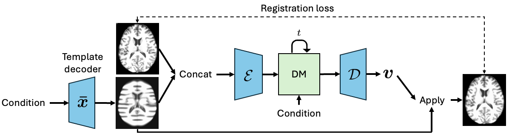
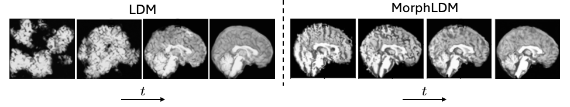

# MorphLDM
MorphLDM is a 3D brain MRI generation method based on state-of-the-art latent diffusion models (LDMs) that generates novel images by applying synthesized deformation fields to a learned template. [[link to paper](https://arxiv.org/abs/2503.03778)]


## Dependencies
- You can reuse the environment you built from https://github.com/tracyhann/3D_Brain_partsLDM/tree/tracy_0220_ddp
- Our code builds directly on [MONAI](https://github.com/Project-MONAI/MONAI/tree/dev) and [GenerativeModels](https://github.com/Project-MONAI/GenerativeModels) repositories.
Make sure they are installed and included in your PYTHONPATH.

## Training on your own data
`config.json` supports two dataset modes:
- `dataset_type: "T1All"`: original MorphLDM dataset loader.
- `dataset_type: "CSV"`: CSV + split-json loader aligned with MONAI transforms used in `scripts/train_3d_VAE.py` (`LoadImaged -> channel select -> Spacingd -> DivisiblePadd`).

For `dataset_type: "CSV"`, set:
- `csv_path`
- `data_split_json_path`
- `conditions` (default includes `age` and `sex`)
- `spacing`, `channel`, `pad_k`

`config.json` contains the hyperparameters for training the models.
`environment_config.json` contains the paths to the data, output directory, and logging information.
Logging defaults to local files (`use_wandb: false`):
- Autoencoder metrics: `<run_dir>/autoencoder/metrics_autoencoder.jsonl`
- Autoencoder recon snapshots: `<run_dir>/autoencoder/reconstructions/` (`train_epoch_XXXX.png`, `val_epoch_XXXX.png`)
- Diffusion metrics: `<run_dir>/diffuion/metrics_diffusion.jsonl`
- Diffusion sample volumes (NIfTI): `<run_dir>/diffuion/sample_volumes/`
- Diffusion sample slices (optional): `<run_dir>/diffuion/sample_slices/` (`diffusion_train.save_sample_slices=true`)
Each metrics jsonl file is reset at run start and includes `run_start` / `metric` / `run_end` events for per-run traceability.
Useful AE save controls in `config.json`:
- `autoencoder_train.save_recon_every` (default `10`)
- `autoencoder_train.save_ckpt_every` (default `10`)

### Train Autoencoder
`python train_autoencoder.py -c config.json -e environment_config.json`

### Train Diffusion UNet
`python train_diffusion.py -c config.json -e environment_config.json`

## Runbook (from scripts.txt)
Run all commands from:
`/home/ttt/Desktop/3Dbrain/morphldm_128`

### 1) Spacing 1.5 setup
```bash
python3 train_autoencoder.py -c config_spacing1p5.json -e environment_config.json
python3 train_diffusion.py -c config_spacing1p5.json -e environment_config.json
```

### 2) Diffusion inference (spacing 1.5)
```bash
python3 infer_diffusion.py -c config_spacing1p5.json -e environment_config.json --inference-config inference_config.json
```

## How it works



MorphLDM differs from LDMs in the design of the encoder/decoder. 
First, a learned template is outputted by a template decoder, optionally conditioned on image-level attributes. 
Then, an encoder takes in both an image and the template and outputs a latent embedding; this latent is passed to a deformation field decoder, whose output deformation field is applied to the template. 
Finally, a registration loss is minimized between the original image and the deformed template with respect to the encoder and both decoders. 
Subsequently, a diffusion model is trained on these learned latent embeddings.

To synthesize an image, MorphLDM generates a novel latent in the same way as standard LDMs. 
The decoder maps this latent to its corresponding deformation field, which is subsequently applied to the learned template.

## Citation
```
@misc{wang2025generatingnovelbrainmorphology,
      title={Generating Novel Brain Morphology by Deforming Learned Templates}, 
      author={Alan Q. Wang and Fangrui Huang and Bailey Trang and Wei Peng and Mohammad Abbasi and Kilian Pohl and Mert Sabuncu and Ehsan Adeli},
      year={2025},
      eprint={2503.03778},
      archivePrefix={arXiv},
      primaryClass={eess.IV},
      url={https://arxiv.org/abs/2503.03778}, 
}
```
